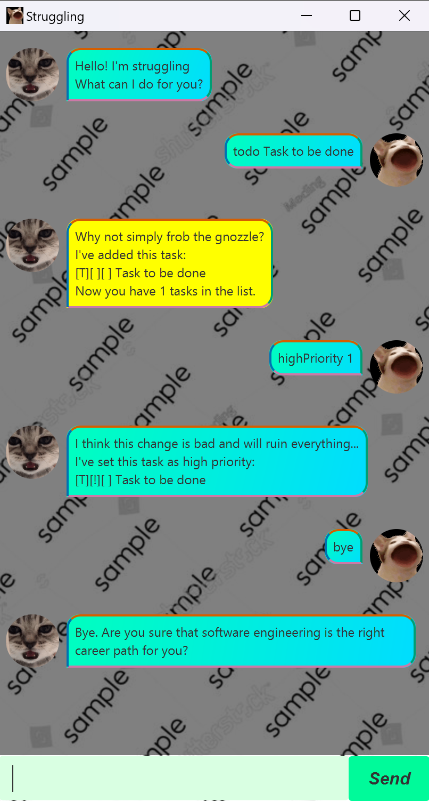

# Struggling User Guide

* [Quick start](#quick-start)
* [Features](#features)
    * [Listing all Tasks : `list`](#listing-all-tasks--list)
    * [Locating Tasks by Description: `find`](#locating-tasks-by-description-find)
    * [Adding a ToDo Task: `todo`](#adding-a-todo-task-todo)
    * [Adding a Deadline Task: `deadline`](#adding-a-deadline-task-deadline)
    * [Adding a Event Task: `event`](#adding-a-event-task-event)
    * [Deleting a Task : `delete`](#deleting-a-task--delete)
    * [Mark a Task : `mark`](#mark-a-task--mark)
    * [Unmark a Task : `unmark`](#unmark-a-task--unmark)
    * [Set a Task's priority to high : `highPriority`](#set-a-tasks-priority-to-high--highpriority)
    * [Set a Task's priority to low : `lowPriority`](#set-a-tasks-priority-to-low--lowpriority)
    * [Exiting the program : `bye`](#exiting-the-program--bye)
    * [Saving the data](#saving-the-data)
    * [Editing the data file](#editing-the-data-file)
* [FAQ](#faq)
* [Command summary](#command-summary)

## Quick start

1. Ensure you have Java  `17`  or above installed in your Computer.
2. Download the latest  `.jar`  file from  [here](https://github.com/KengHian/ip/releases).
3. Copy the file to the folder you want to use as the  _home folder_  for your chatbot.
4. Open a command terminal,  `cd`  into the folder you put the jar file in, and use the
   `java -jar Struggling.jar`  command to run the application.

   A GUI similar to the below should appear in a few seconds.

5. Type the command in the command box and press Enter or click to execute it.
   Some example commands you can try:
    - `todo First Task` : Add the first task to the chatbot.
    - `list`  : Lists all tasks.
    - `delete 1`  : Deletes the 1st task shown in the current list.
    - `bye`  : Exits the app.

6. Refer to the  [Features](#features)  below for details of each command.

## Features

> **Notes about the command format:**
>
> - Words in  `UPPER_CASE`  are the parameters to be supplied by the user.  
    >     e.g. in  `todo DESCRIPTION`,  `DESCRIPTION`  is a parameter which can be used as  `todo First Task`.
>
> - Parameters must be in order specified.  
    >     e.g. if the command specifies  `DESCRIPTION /from DATE`,  `/from DATE DESCRIPTION`  is **NOT**
    > acceptable.
>
> - No extraneous parameters should be provided for commands that do not take in parameters (such as
    > `list`, `bye`).

### Listing all Tasks : `list`

Shows a list of all tasks in the chatbot.

Format:  `list`

### Locating Tasks by Description: `find`

Find all matching tasks via their description.

Format:  `find KEYWORD`

### Adding a ToDo Task: `todo`

Adds a ToDo task to the chatbot.

Format:  `todo DESCRIPTION​`

### Adding a Deadline Task: `deadline`

Adds a Deadline task to the chatbot.

Format:  `deadline DESCRIPTION​ /by DATE`

### Adding a Event Task: `event`

Adds a Event task to the chatbot.

Format:  `event DESCRIPTION​ /from DATE /by DATE`

### Deleting a Task : `delete`

Delete a task.

Format: `delete INDEX`

### Mark a Task : `mark`

Mark a task as done.

Format: `mark INDEX`

### Unmark a Task : unmark

Mark a task as not done.

Format: `unmark INDEX`

### Set a Task's priority to high : `highPriority`

Mark a task as high priority.

Format: `highPriority INDEX`

### Set a Task's priority to low : `lowPriority`

Mark a task as low priority.

Format: `lowPriority INDEX`

### Exiting the program : `bye`

Exit the program.

Format: `bye`

### Saving the data

Chatbot data are saved in the hard disk automatically after any command that changes the data. There is no
need to save manually.

### Editing the data file

Chatbot data are saved automatically as a txt file `[JAR file location]/data/Struggling.txt`. Advanced users
are welcome to update data directly by editing that data file.

> **Caution:** If your changes to the data file makes its format invalid, or value entered is outside of the
> acceptable range,
> Struggling chatbot will discard all data and start with an empty data
> file at the next run. Hence, it is recommended to take a backup of the
> file before editing it. Therefore, edit the data file only if you are
> confident that you can update it correctly.

## FAQ

**Q**: How do I transfer my data to another Computer?  
**A**: Install the app in the other computer and overwrite the empty data file it creates with the file that
contains the data of your previous Struggling chatbot home folder.

## Command summary

| Action        | Format                                  | Examples                                                  |
|---------------|-----------------------------------------|-----------------------------------------------------------|
| List          | `list`                                  |                                                           |
| Find          | `find KEYWORD`                          | e.g., `find meeting`                                      |
| ToDo          | `todo DESCRIPTION`                      | e.g., `todo First Task`                                   |
| Deadline      | `deadline DESCRIPTION /by DATE`         | e.g., `deadline iP finalization /by 2024-09-22`           |
| Event         | `event DESCRIPTION /from DATE /to DATE` | e.g., `event reading week /from 2024-09-21 to 2024-09-29` |
| Delete        | `delete INDEX`                          | e.g., `delete 1`                                          |
| Mark          | `mark INDEX`                            | e.g., `mark 2`                                            |
| Unmark        | `unmark INDEX`                          | e.g., `unmark 3`                                          |
| High Priority | `highPriority INDEX`                    | e.g., `highPriority 4`                                    |
| Low Priority  | `lowPriority INDEX`                     | e.g., `lowPriority 5`                                     |
| Exit          | `bye`                                   |                                                           |
